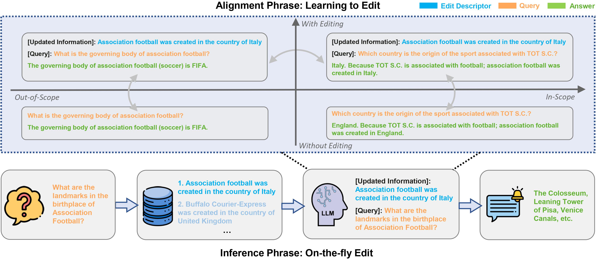

# Learning to Edit: Aligning LLMs with Knowledge Editing (ACL 2024)

[](https://github.com/YJiangcm/LTE)
[](https://huggingface.co/datasets/YuxinJiang/LTE_train_data)

We introduces a novel Learning to Edit (**LTE**) framework for effective and efficient knowledge editing of large language models (LLMs).
our LTE framework focuses on teaching LLMs to **apply** updated knowledge into input questions, inspired by the philosophy of "_Teach a man to fish_."

As the below figure shows, LTE features a two-phase process: (i) the **Alignment Phase**, which fine-tunes LLMs on a meticulously curated parallel dataset to make reliable, in-scope edits while preserving out-of-scope information and linguistic proficiency; and (ii) the **Inference Phase**, which employs a retrieval-based mechanism for real-time and mass knowledge editing.

<p align="center">
    <br>
    
    <br>
</p>

## ⚙️ How to implement

### Requirements
**Note: Please use Python 3.10+ for LTE.**  To get started, simply install conda and run:
```
conda create -n LTE python=3.10
conda activate LTE
conda install pytorch==2.1.1 torchvision==0.16.1 torchaudio==2.1.1 pytorch-cuda=12.1 -c pytorch -c nvidia
pip install -r requirements.txt
```

### 1. Alignment Phrase
Firstly, please download the training data of LTE from [HuggingFace](https://huggingface.co/datasets/YuxinJiang/LTE_train_data) and put it into [data/](data/).

#### LLaMA2-Chat-7B
The code is based on [FastChat](https://github.com/lm-sys/FastChat). Standard fine-tuning was conducted on 4×A100 GPUs (80G) for about 9 hours.
```bash
cd LTE/
bash FastChat/ft_train.sh
```

To reduce the total memory footprint, LTE also supports [LoRA](https://arxiv.org/abs/2106.09685), which fine-tunes low-rank slices of the query, key, and value embedding heads.
```bash
cd LTE/
bash FastChat/lora_train.sh
```

#### Qwen-Chat-7B
The code is based on [Qwen](https://github.com/QwenLM/Qwen). Standard fine-tuning was conducted on 4×A100 GPUs (80G) for about 9 hours.
```bash
cd LTE/
bash Qwen/finetune/finetune_ds.sh
```

To reduce the total memory footprint, LTE also supports [LoRA](https://arxiv.org/abs/2106.09685), which fine-tunes low-rank slices of the query, key, and value embedding heads.
```bash
cd LTE/
bash Qwen/finetune/finetune_lora_single_gpu.sh
```

### 2. Inference Phrase
The evaluation of our proposed LTE is based on [EasyEdit](https://github.com/zjunlp/EasyEdit). Please download [multi-qa-mpnet-base-dot-v1](https://huggingface.co/sentence-transformers/multi-qa-mpnet-base-dot-v1) and add it to "LTE/SeqEdit/multi-qa-mpnet-base-dot-v1".

Please run the following command for experiments of **LLaMA2-Chat-7B**:
```bash
cd LTE/
bash EasyEdit/run_lte_llama.sh
bash SeqEdit/run_lte_llama.sh
```

Please run the following command for experiments of **Qwen-Chat-7B**:
```bash
cd LTE/
bash EasyEdit/run_lte_qwen.sh
bash SeqEdit/run_lte_qwen.sh
```


## 📝 Citation
Please cite our paper if you use the data or code in this repo.
```
@misc{jiang2024lte,
      title={Learning to Edit: Aligning LLMs with Knowledge Editing}, 
      author={Yuxin Jiang and Yufei Wang and Chuhan Wu and Wanjun Zhong and Xingshan Zeng and Jiahui Gao and Liangyou Li and Xin Jiang and Lifeng Shang and Ruiming Tang and Qun Liu and Wei Wang},
      year={2024},
      eprint={2402.11905},
      archivePrefix={arXiv},
      primaryClass={cs.CL}
}
```
