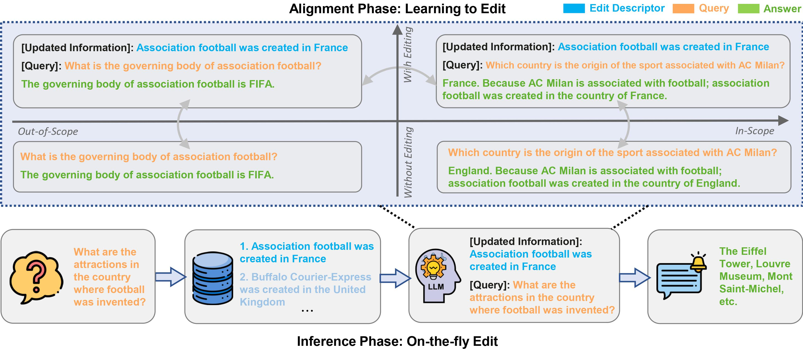

# Learning to Edit: Aligning LLM Behavior with Knowledge Editing

<p align="center">
    <br>
    
    <br>
</p>

## ⚙️ How to implement

### Requirements
**Note: Please use Python 3.10+ for LTE.**  To get started, simply install conda and run:
```
conda create -n LTE python=3.10
conda activate LTE
conda install pytorch==2.1.1 torchvision==0.16.1 torchaudio==2.1.1 pytorch-cuda=12.1 -c pytorch -c nvidia
pip install -r requirements.txt
```

### 1. Alignment Phrase
Firstly, please download the training data of LTE from [HuggingFace](https://huggingface.co/datasets/YuxinJiang/LTE_train_data) and put it into [data/](data/).

#### LLaMA2-Chat-7B
The code is based on [FastChat](https://github.com/lm-sys/FastChat). Standard fine-tuning was conducted on 4×A100 GPUs (80G) for about 9 hours.
```bash
cd LTE/
bash FastChat/ft_train.sh
```

To reduce the total memory footprint, LTE also supports [LoRA](https://arxiv.org/abs/2106.09685), which fine-tunes low-rank slices of the query, key, and value embedding heads.
```bash
cd LTE/
bash FastChat/lora_train.sh
```

#### Qwen-Chat-7B
The code is based on [Qwen](https://github.com/QwenLM/Qwen). Standard fine-tuning was conducted on 4×A100 GPUs (80G) for about 9 hours.
```bash
cd LTE/
bash Qwen/finetune/finetune_ds.sh
```

To reduce the total memory footprint, LTE also supports [LoRA](https://arxiv.org/abs/2106.09685), which fine-tunes low-rank slices of the query, key, and value embedding heads.
```bash
cd LTE/
bash Qwen/finetune/finetune_lora_single_gpu.sh
```

### 2. Inference Phrase
The evaluation of our proposed LTE is based on [EasyEdit](https://github.com/zjunlp/EasyEdit).

Please run the following command for experiments of **LLaMA2-Chat-7B**:
```bash
cd LTE/
bash EasyEdit/run_lte_llama.sh
```

Please run the following command for experiments of **Qwen-Chat-7B**:
```bash
cd LTE/
bash EasyEdit/run_lte_qwen.sh
```


## 📝 Citation
Please cite our paper if you use the data or code in this repo.
```
@misc{jiang2023followbench,
      title={FollowBench: A Multi-level Fine-grained Constraints Following Benchmark for Large Language Models}, 
      author={Yuxin Jiang and Yufei Wang and Xingshan Zeng and Wanjun Zhong and Liangyou Li and Fei Mi and Lifeng Shang and Xin Jiang and Qun Liu and Wei Wang},
      year={2023},
      eprint={2310.20410},
      archivePrefix={arXiv},
      primaryClass={cs.CL}
}
```
